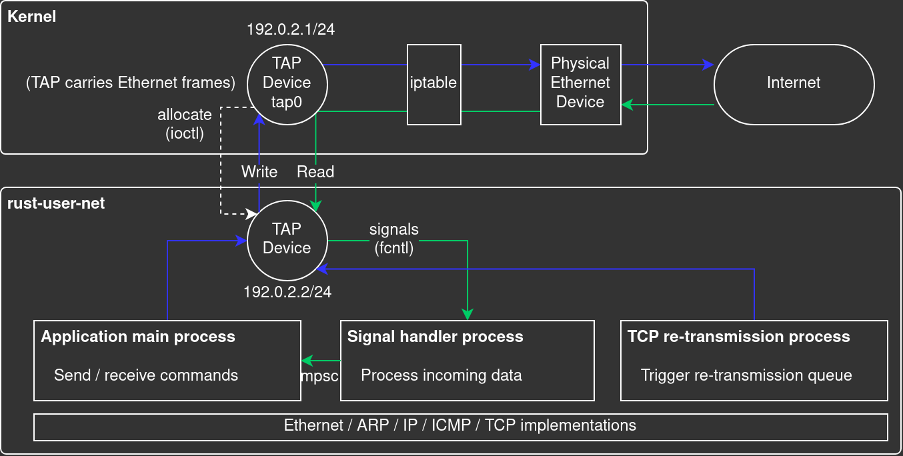

# rust-user-net

User-space network protocol stack written in Rust for study / experiment purpose

Talks Ethernet / ARP / IP / ICMP / UDP / TCP through TAP device on Linux.


This project is by and large a Rust port of [microps](https://github.com/pandax381/microps) project written in C. Many thanks to [the owner](https://github.com/pandax381) for awesome codes and shared [decks](https://drive.google.com/drive/folders/1k2vymbC3vUk5CTJbay4LLEdZ9HemIpZe?usp=share_link) (Japanese).

### High-level View



### Setup and Usage

- Built and tested on Ubuntu 22.04

```sh
cd rust-user-net

# Build
cargo build

# TAP device setup (will be reset on reboot)
./set_tap.sh

# If you want rust-user-net to connect to Internet:
# Output interface name is assumed to be `wlp0s20f3`.
# Please update it if it's different in your machine.
./set_forward.sh

# Show help
./rust-user-net -h
./rust-user-net tcp -h
./rust-user-net tcp send -h
```

### Example

HTTP (TCP: 80) request to `http://www.google.com`:

```sh
# Send command sends a request and gets into receive loop
rust-user-net tcp send 142.250.4.138 80 'GET / HTTP/1.1\r\nHost: www.google.com\r\n\r\n'
```

### Local Tests with netcat

```sh
# TCP

# Test send command:
# nc listens for TCP active open (3-way handshake) from rust-user-net
nc -nv -l 10007
rust-user-net tcp send 192.0.2.1 10007 "TCP TEST DATA"

# Test receive command:
# nc connects and sends data to rust-user-net (192.0.2.2:7) 
rust-user-net tcp receive 0.0.0.0 7
nc -nv 192.0.2.2 7 # -n: no name resolution

# UDP

# Test send command:
# nc listens for UDP data from rust-user-net
nc -u -l 10007
rust-user-net udp send 192.0.2.1 10007 "UDP TEST DATA"

# Test receive command:
# nc sends UDP data to rust-user-net (192.0.2.2:7)
rust-user-net udp receive 0.0.0.0 7
nc -u 192.0.2.2 7 # -u: UDP mode
```